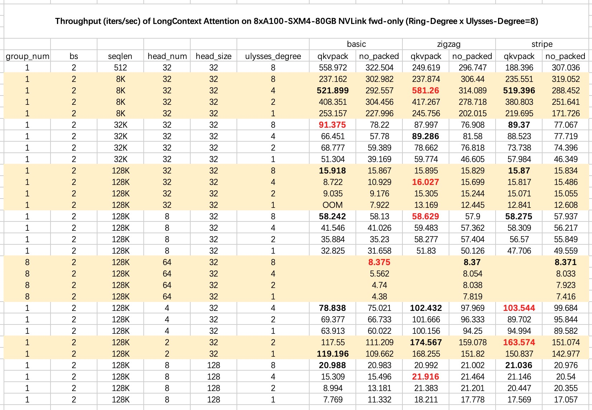

#  YunChang: A Unified Sequence Parallel (USP) Attention for Long Context LLM Model Training and Inference.

[\[Tech Report\] USP: A Unified Sequence Parallelism Approach for Long Context Generative AI](https://arxiv.org/abs/2405.07719)


<p align="center">
    
</p>

This repo provides a sequence parallel approach that synergizes the strengths of two popular distributed attentions, i.e. DeepSpeed-Ulysses-Attention and Ring-Attention, delivering a more general and stronger versatility and better performance. 
The project is built on [zhuzilin/ring-flash-attention](https://github.com/zhuzilin/ring-flash-attention) and refers to the [DeepSpeed-Ulysses](https://github.com/microsoft/DeepSpeed/blob/master/blogs/deepspeed-ulysses/README.md).

USP has been applied in [NVIDIA/TransformerEngine](https://github.com/NVIDIA/TransformerEngine/blob/54aa12a9a1f166c53a20f17f309adeab5698f5f6/transformer_engine/pytorch/attention.py#L1542) `AttnFuncWithCPAndKVP2P`. You can use it in API `attn_forward_func_with_cp`.


## Why not apply Ulysses and Ring Attention Individually?

- Ulysses is sensitive to the number of attention heads. 
The parallelism degree in Ulysses cannot exceed the number of heads. 
Consequently, it is not suitable for GQA (Grouped Query Attention) and MQA (Multi-Query Attention) scenarios. For instance, Ulysses does not operate effectively with a single head. 
In addition, since Tensor Parallelism also requires division across the head number dimension, achieving compatibility between Ulysses and TP can be challenging.

- Ring-Attention is ineffient than Ulysses in computation and communication.
Ring-Attention segments the Query, Key, and Value (QKV) into smaller blocks, which can lead to a decrease in efficiency when using FlashAttention.
Even with the communication and computation processes fully overlapped, the total execution time lags behind that of Ulysses. 
Furthermore, Ring-Attention utilizes asynchronous peer-to-peer communication, which not only has a lower bandwidth utilization compared to collective communication methods but also poses the risk of potential communication deadlocks in large-scale deployments.


## LongContextAttention, also known as Unified Sequence Parallelism and Hybrid Sequence Parallelism

`LongContextAttention` is a **unified sequence parallel** , also known as **hybrid sequence parallel** ,that hybrid DeepSpeed-Ulysses-Attention and Ring-Attention therefore addressing the limitations of both methods.

<p align="center">
    
</p>


### 1. Installation

FlashAttention is the most important external dependency and is often the cause of errors when installing and using yunchang. 
Yunchang supports flash_attn 2.6.x and 2.7.x, both v3 and v2 versions. Additionally, yunchang supports runs without flash_attn, which is suitable for NPUs.

As shown in the figure below, there are three usage methods based on the flash_attn situation:

1. For H100, B100, hardware that supports FA v3, ring_flash_attn uses FA v3.

2. For A100, L40, hardware that supports FA v2, ring_flash_attn uses FA v2.

3. For hardware such as NPUs that does not support FA, use torch to implement attention computation. In this case, there is no need to install `flash_attn`, and you should apply `LongContextAttention(ring_impl_type="basic", attn_type=AttnType.TORCH)`. *Note: the backward pass is not supported for AttnType.TORCH.*

Option 1: pip install

`pip install flash-attn`

`pip install yunchang`

#### Apply FlashAttention V3: Since FA V3 is beta-released, you need to install FlashAttention V3 from source code.

Follow the [FlashAttention beta-release](https://github.com/Dao-AILab/flash-attention?tab=readme-ov-file#flashattention-3-beta-release) to install V3 for NVIDIA Hopper GPUs.

We applied the Nov 10 2024 commit `b443207c1fc4c98e4532aad4e88cfee1d590d996`.


Option 2: build from local.

`pip install .`

Install for AMD GPU: [install_amd.md](./docs/install_amd.md)


### 2. Usage

Please refer to [test/test_hybrid_qkvpacked_attn.py](./test/test_hybrid_qkvpacked_attn.py) and [test/test_hybrid_attn.py](./test/test_hybrid_attn.py) for usage.

In short, we take the `zigzag` ring attention implementation as an example:

1. apply `set_seq_parallel_pg` to set the process group
2. extract local tensors with `zigzag_extract_local`. We need reorder the input tokens or input tensors for load balance ring attention.
3. then apply `LongContextAttention(ring_impl_type="zigzag")` as a drop-in replacement for Attention implementation.

```python
from yunchang import (
    AsyncLongContextAttention,
    LongContextAttention,
    set_seq_parallel_pg,
    EXTRACT_FUNC_DICT
)
from yunchang.kernels import AttnType

sp_ulysses_degree = 2
sp_ring_degree = 4

# support world_size = 8
set_seq_parallel_pg(sp_ulysses_degree, sp_ring_degree, rank, world_size)

# attn_type could be FA, FA3, TORCH.
longctx_attn = LongContextAttention(ring_impl_type="zigzag", attn_type=AttnType.FA)

# if you use NPUs, where no flash_attn is supported, you can use the following code.
# LongContextAttention(ring_impl_type="zigzag", attn_type=AttnType.TORCH)

# extract a local shard for the global Q, K, V.
local_q = EXTRACT_FUNC_DICT["zigzag"](
        Q, rank, world_size=world_size, rd=sp_ring_degree, ud=sp_ulysses_degree
    ).detach().clone()
...

local_out = usp_attn(
        local_q,
        local_k,
        local_v,
        dropout_p=dropout_p,
        causal=True, # zigzag and stripe is load balance strategy for causal=True
        window_size=window_size,
        softcap=0.0,
        alibi_slopes=alibi_slopes,
        deterministic=deterministic,
        return_attn_probs=True,
    )

```

### 3.Test

```bash
torchrun --nproc_per_node=4 ./test/test_hybrid_attn.py --sp_ulysses_degree 2 --ring_impl_type "zigzag" --causal --attn_impl fa --use_bwd
torchrun --nproc_per_node=4 ./test/test_hybrid_attn.py --sp_ulysses_degree 2 --ring_impl_type "zigzag" --causal --attn_impl torch
torchrun --nproc_per_node 8 test/test_hybrid_qkvpacked_attn.py
```

### 4. Verified in Megatron-LM
The loss curves for Data Parallel (DP) and Unified Sequence Parallel (ulysses=2+ring=2) are closely aligned, as illustrated in the figure. This alignment confirms the accuracy of the unified sequence parallel.

<p align="center">
    
</p>

When utilizing load-balance Ring Attention with a causal mask, it is essential to reorder the Query tensors using the [EXTRACT_FUNC_DICT](./yunchang/comm/extract_local.py) function.

In Megatron-LM, you can reorder the input tokens before feeding them into the model and apply the same reordering to the RoPE parameters. For detailed instructions, please refer to our paper.

For an example implementation, you can check out this [PR](https://github.com/FlagOpen/FlagScale/commit/f98ee1e293bd906cc77f512f7a884b2030c10a12), which integrates USP into a BAAI's Megatron-LM framework.

### 6. Benchmark


```bash
bash ./scripts/run_qkvpack_compare.sh
```

On an 8xA100 NVLink machine, the benchmark results are as follows:

<p align="center">
    
</p>

On an 8xL20 PCIe machine and a 4xA100 PCIe machine, the benchmark results are as follows:

<p align="center">
    
</p>

Some Conclusions:

1. If the head number is enough, Ulysses outperforms Ring-Attention. The All-to-All communication of Ulysses is highly efficient within a single machine, with a very low overhead ratio. In contrast, Ring splits computation and communication, which increases the overall of computation time, and even with complete overlap, it is slower than Ulysses.

2. QKV packed (`LongContextAttentionQKVPacked`) is better than the QKV no packed (`LongContextAttention`) version, with the difference becoming more pronounced as the sequence length decreases. MAQ and GQA can only use the no packed version.

3. Among the variants of the Ring-Attention implementation, `zigzag` and `stripe` perform better than `basic`. Typically, zigzag is slightly better than stripe, but as the sequence length increases, the difference between zigzag and stripe becomes less noticeable. It is worth noting that both zigzag and stripe have specific layout requirements for the sequence dimension.

4. Hybrid parallelism works well to heterogeneous network devices. For example, on an 8-GPU L20 setup, the optimal performance is achieved when ulysess_degree is set to 2 and ring_degree is set to 4.

### 7. Best Practice for 4D Parallelism

We analyze the impact of introducing Sequnce Parallelism to Data/ZeRO/Tensor/Pipeline Parallelism in a technique report, which can be found at [here](https://arxiv.org/abs/2405.07719).

Some best practices are listed here:

1. We suggest using Unified-SP in place of SP-Ring and SP-Ulysses, as it encompasses the capabilities of both while offering additional benefits.

2. DP (data parallelism) vs SP: We suggest prioritizing the use of DP over SP if possible. 
Only when the batch size (bs) is insufficient for partitioning should one consider whether to employ SP

3. Utilizing SP, it should always be used in conjunction wit ZeRO-1/2.

4. Unified-SP has lower communication cost than Tensor Parallel with megatron-lm sequence parallelism (TP-sp)! You can use Unified-SP to replace TP for better speed. However, now switching TP (tensor parallelism) to SP+ZeRO2 cannot increase the sequence length in training. SP+ZeRO3 can train a similar sequence length as TP-sp. We suggest that SP may have an advantage over TP when employing GQA in terms of communication cost, as GQA can reduce the communication cost of SP without affecting TP.

5. Setting a higher parallel degree of SP parallelism is possible, which may need to set a large ring degree when the head number is limited, to train a long sequence across a greater number of computational devices. But TP could not be set a high parallel.


### 8. Projects apply USP
I am honored that this repository has contributed to the following projects:

1. [xdit-project/xDiT](https://github.com/xdit-project/xDiT)
2. [NVlabs/VILA](https://github.com/NVlabs/VILA/blob/main/LongVILA.md)
3. [feifeibear/Odysseus-Transformer](https://github.com/feifeibear/Odysseus-Transformer)
4. [Ascend/AscendSpeed](https://gitee.com/ascend/AscendSpeed/blob/master/docs/features/hybrid-context-parallel.md)
5. [jzhang38/EasyContext](https://github.com/jzhang38/EasyContext)
6. [FlagOpen/FlagScale](https://github.com/FlagOpen/FlagScale/commit/f98ee1e293bd906cc77f512f7a884b2030c10a12)
7. [zhiyuanhubj/LongRecipe](https://github.com/zhiyuanhubj/LongRecipe)
8. [NVIDIA/TransformerEngine](https://github.com/NVIDIA/TransformerEngine/blob/54aa12a9a1f166c53a20f17f309adeab5698f5f6/transformer_engine/pytorch/attention.py#L1542)
9. [xdit-project/mochi-xdit](https://github.com/xdit-project/mochi-xdit)
 
### 9. Cite Us

[USP: A Unified Sequence Parallelism Approach for Long Context Generative AI](https://arxiv.org/abs/2405.07719)

```
@article{fang2024unified,
  title={A Unified Sequence Parallelism Approach for Long Context Generative AI},
  author={Fang, Jiarui and Zhao, Shangchun},
  journal={arXiv preprint arXiv:2405.07719},
  year={2024}
}

```
