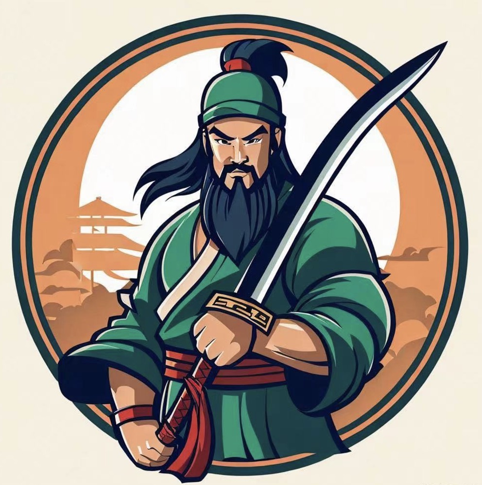

# Long-Context-Attention (YunChang-云长): Sequence Parallel Attention for Long Context LLM Model Training and Inference

<p align="center">
    
</p>

This repo provides a sequence parallel approaches which synergizes the strengths of two popular distributed attentions, i.e. DeepSpeed-Ulysses-Attention and Ring-Attention, delivering a more general and stronger versatility and better performance. 
The project is built on [zhuzilin/ring-flash-attention](https://github.com/zhuzilin/ring-flash-attention) and refers to the [DeepSpeed-Ulysses](https://github.com/microsoft/DeepSpeed/blob/master/blogs/deepspeed-ulysses/README.md).

## What's wrong with Ulysses and Ring?

- Ulysses is sensitive to the number of attention heads. 
The parallelism degree in Ulysses cannot exceed the number of heads. 
Consequently, it is not suitable for GQA (Grouped Query Attention) and MQA (Multi-Query Attention) scenarios. For instance, Ulysses does not operate effectively with a single head. 
In addition, since Tensor Parallelism also requires the division across the head number dimension, achieving compatibility between Ulysses and TP can be challenging.

- Ring-Attention is ineffient than Ulysses in computation and communication.
Ring-Attention segments the Query, Key, and Value (QKV) into smaller blocks, which can lead to a decrease in efficiency when using FlashAttention.
Even with the communication and computation processes fully overlapped, the total execution time lags behind that of Ulysses. 
Furthermore, Ring-Attention utilizes asynchronous peer-to-peer communication, which not only has a lower bandwidth utilization compared to collective communication methods but also poses the risk of potential communication deadlocks in large-scale deployments.


## LongContextAttention (Hybrid Ulysses-Ring Attention)

`LongContextAttention` is a **sequence parallel approach** that integrates the strengths of DeepSpeed-Ulysses-Attention and Ring-Attention while addressing the limitations of both methods.

<p align="center">
    
</p>

**Features:**

1. No Limitation on the Number of Heads: Our approach does not impose a restriction on the number of heads, providing greater flexibility for various attention mechanisms.

2. Comprehensive Capability: It encompasses the functionalities of both Ulysses and Ring models. By setting the ulysses_degree to the sequence parallel degree, the system operates identically to Ulysses. Conversely, setting the ulysses_degree to 1 mirrors the functionality of Ring.

3. Enhanced Performance: We achieve superior performance benchmarks over both Ulysses and Ring, offering a more efficient solution for attention mechanism computations.

4. Compatibility with Advanced Parallel Strategies: LongContextAttention is fully compatible with other sophisticated parallelization techniques, including Tensor Parallelism, ZeRO, and Pipeline Parallelism, ensuring seamless integration with the latest advancements in parallel computing.

### Test

```bash
torchrun --nproc_per_node 8 test/test_hybrid_qkvpacked_attn.py
```

### Benchmark


```bash
bash ./scripts/run_qkvpack_compare.sh
```

On an 8xA100 NVLink machine, and the benchmark results are as follows:

<p align="center">
    
</p>

On an 8xL20 PCIe machine and an 4xA100 PCIe machine, and the benchmark results are as follows:

<p align="center">
    
</p>

Some Conclusions:

1. If the head number is enough, Ulysses outperforms Ring-Attention. The All-to-All communication of Ulysses is highly efficient within a single machine, with a very low overhead ratio. In contrast, Ring splits computation and communication, which increases the overall of computation time, and even with complete overlap, it is slower than Ulysses.

2. QKV packed (`LongContextAttentionQKVPacked`) is better than the QKV no packed (`LongContextAttention`) version, with the difference becoming more pronounced as the sequence length decreases. MAQ and GQA can only use the no packed version.

3. Among the variants of the Ring-Attention implementation, `zigzag` and `stripe` perform better than `basic`. Typically, zigzag is slightly better than stripe, but as the sequence length increases, the difference between zigzag and stripe becomes less noticeable. It is worth noting that both zigzag and stripe have specific layout requirements for the sequence dimension.

4. Hybrid parallelism works well to heterogeneous network devices. For example, on an 8-GPU L20 setup, the optimal performance is achieved when ulysess_degree is set to 2 and ring_degree is set to 4.

## TODOs

1. Integrates other Ring-Attention Versions, for example [ring-attention-pytorch](https://github.com/lucidrains/ring-attention-pytorch).

2. Apply `LongContextAttention` in DeepSpeed and Megatron.

**Looking for your contributions and feedbacks.**

## Citation
```
@misc{fang2024long,
      title={Long-Context-Attention: Distributed Attention Implementations for Long Context LLM Model Training},
      author={Jiarui Fang},
      year={2024},
      publisher = {GitHub},
      journal = {GitHub repository},
      howpublished = {\url{https://github.com/feifeibear/long-context-attention}},
}
@article{jacobs2023deepspeed,
      title={Deepspeed ulysses: System optimizations for enabling training of extreme long sequence transformer models},
      author={Jacobs, Sam Ade and Tanaka, Masahiro and Zhang, Chengming and Zhang, Minjia and Song, Leon and Rajbhandari, Samyam and He, Yuxiong},
      journal={arXiv preprint arXiv:2309.14509},
      year={2023}
}
@article{liu2023ring,
      title={Ring attention with blockwise transformers for near-infinite context},
      author={Liu, Hao and Zaharia, Matei and Abbeel, Pieter},
      journal={arXiv preprint arXiv:2310.01889},
      year={2023}
}
@misc{zhu2024ring,
      title={Ring Flash Attention},
      author={Zilin Zhu and Yang Yu},
      year={2024},
      publisher = {GitHub},
      journal = {GitHub repository},
      howpublished={\url{https://github.com/zhuzilin/ring-flash-attention}},
}
```
