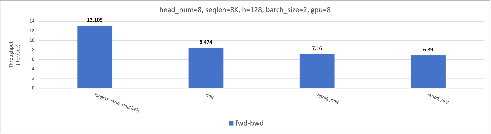
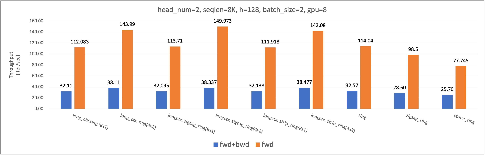

# Long-Context-Attention: Distributed Attention Implementations for Long Context LLM Model Training and Inference
This repo provides a distributed sequence parallel approaches called Long-Context-Attention. It synergizes the strengths of two popular distributed attentions, i.e. DeepSpeed-Ulysses-Attention and Ring-Attention, delivering a superior performance that outshines its predecessors.

## LongContextAttention (Hybrid Ulysses-Ring Attention)

LongContextAttention is a **sequence parallel approach** that integrates the strengths of DeepSpeed-Ulysses-Attention and Ring-Attention while addressing the limitations of both methods.

- Ulysses is sensitive to network architecture and the parallel degree can not be larger than the number of heads, which makes it not suitable for GQA and MQA. For example, Ulysses fails to operate when the head_num is set to 1.

- Ring-Attention segments QKV into smaller blocks and performs P2P (peer-to-peer) communication, which has a lower bandwidth utilization compared to collective communication. For instance, in the first diagram below (with head_num=8), Ulysses Degree=8 is significantly lower than Ulysses Degree=1, which illustrates the inefficiency of Ring-Attention.

By partitioning the sequence parallel Process Group into Ulysses and Ring Process Groups, LongContextAttention aims to integrate the strengths of both methods navigating around their individual limitations.

LongContextAttention is compatible with the other parallel strategies, such as Tensor Parallelism, ZeRO, Pipeline Parallelism.

### Test

```bash
torchrun --nproc_per_node 8 test/test_long_context_qkvpacked_attn.py
```

### Benchmark

You can try to tune `ulysses_degree`, `ring_impl_type` for the best performance.

```
FWD_FLAG=""
NHEADS=8

for RING_IMPL_TYPE in "basic" "zigzag" "strip"; do
torchrun --nproc_per_node 8 benchmark/benchmark_longctx_qkvpacked.py --nheads $NHEADS --batch_size 2 $FWD_FLAG --ulysses_degree 1 --ring_impl_type $RING_IMPL_TYPE
torchrun --nproc_per_node 8 benchmark/benchmark_longctx_qkvpacked.py --nheads $NHEADS --batch_size 2 $FWD_FLAG --ulysses_degree 2 --ring_impl_type $RING_IMPL_TYPE
torchrun --nproc_per_node 8 benchmark/benchmark_longctx_qkvpacked.py --nheads $NHEADS --batch_size 2 $FWD_FLAG --ulysses_degree 4 --ring_impl_type $RING_IMPL_TYPE
torchrun --nproc_per_node 8 benchmark/benchmark_longctx_qkvpacked.py --nheads $NHEADS --batch_size 2 $FWD_FLAG --ulysses_degree 8 --ring_impl_type $RING_IMPL_TYPE
done

torchrun --nproc_per_node 8 benchmark/benchmark_qkvpacked_func.py --nheads $NHEADS --batch_size 2 $FWD_FLAG
```

The following two pictures demostrate the throughput (iters/sec) of different sequence parallel approaches on 8xA100 connected with NVLINK.
Note that no-comm is an flash-attention version conduct flash-attn locally without communications. 
It can be viewed as the upper bound of the sequence parallel implementation.

- head num=8

The throughput (iters/sec) of different LongContextAttention settings (ring_degree x ulysses_degree) is shown in the following table. 
We observed that the best throughput is achieved when `ulysses_degree`=4 and ring_attn_impl as `strip`.

| (ring_degree x ulysses_degree) | 8x1   | 4x2   | 2x4   | 1x8   |
|--------------------------------|-------|-------|-------|-------|
| basic                          | 8.161 | 11.151| **12.84** | 10.588|
| zigzag                         | 8.211 | 11.024| **12.864**| 10.679|
| strip                          | 8.464 | 10.964| **13.105**| 10.589|


In the figure presented below, we contrast the performance of LongContextAttention with that of ring-flash-attention. Notably, LongContextAttention demonstrates a remarkable **54%** increase in throughput, showcasing its superior efficiency over the ring-flash-attention approach.




- head num=2, note that ulysses degree is limited to <=2.

The best throughtput is achieved when `ulysses_degree`=2 and ring_attn_impl as `zigzag`. We observed 18% and 31% throughput improvement for FWD+BWD and FWD-only.



## Ulysses Attention
This repository re-implements the all-to-all communication functions and support QKV packed togather, following the principles of [DeepSpeed-Ulysses](https://github.com/microsoft/DeepSpeed/blob/master/blogs/deepspeed-ulysses/README.md).
It is important to note that DeepSpeed-Ulysses does not accommodate scenarios where the number of attention heads surpasses the size of the world (i.e., the total number of GPUs in the distributed setup).

Below, I will use a diagram of FlashAttention Style to illustrate the workflow of deepspeed-ulysses. 
In the diagram, 'N' represents the sequence length, 'd' denotes the hidden size calculated as hidden_size = (hc * hs), where 'hc' stands for the number of heads, and 'hs' is the size of each head. 'P' indicates the number of GPUs (with 'P=4' in the diagram).

As we can see, if the hc < 4, we can not compute attention in one single GPU.


### Test

```bash
torchrun --nproc_per_node 8 test/test_ulysses_attn.py
```

## Ring Attention


Ring-Attention use the code from repo [zhuzilin/ring-flash-attention](https://github.com/zhuzilin/ring-flash-attention), which implements the [RingAttention](https://github.com/lhao499/RingAttention) with [FlashAttention](https://github.com/Dao-AILab/flash-attention). 


Below, I use a diagram to illustrate the workflow of one single head of ring-attention. Note there are hcx such workflow in paralle.


We reuse the APIs:

- `ring_flash_attn_func`: ring attention version of `flash_attn_func`
- `ring_flash_attn_varlen_func`: ring attention version of `flash_attn_varlen_func`
- `zigzag_ring_flash_attn_func`: an optimized version of `ring_flash_attn_func`, see [issue#2](https://github.com/zhuzilin/ring-flash-attention/issues/2)
- `zigzag_ring_flash_attn_varlen_func`: an optimized version of `ring_flash_attn_varlen_func`
- `stripe_flash_attn_func`: stripe attention version of `ring_flash_attn_func`, the block size is set to 1 to use flash_attn api.

Note that

- all function has the `*_func`, `*_kvpacked_func`, `*_qkvpacked_func` variant implemented.
- the varlen versions only support passing one `cu_seqlens`.

The main idea is to use the `softmax_lse` output from the flash attention kernels.

### Limits

There are some arithmetic errors with the current implementation. The reason for them is probably that flash attention will return bf16 value for each block, so we cannot accumluate the values with the original fp32 ones.

And also because we need to save extra fp32 buffer during computation, the memory usage would be higher than theoretic limit.

### Test

```bash
torchrun --nproc_per_node 8 test/test_ring_flash_attn_func.py
torchrun --nproc_per_node 8 test/test_ring_flash_attn_varlen_func.py
torchrun --nproc_per_node 8 test/test_zigzag_ring_flash_attn_func.py
torchrun --nproc_per_node 8 test/test_zigzag_ring_flash_attn_varlen_func.py
torchrun --nproc_per_node 8 test/test_stripe_flash_attn_func.py
```

## Citation
```
@misc{fang2024long,
      title={Long-Context-Attention: Distributed Attention Implementations for Long Context LLM Model Training},
      author={Jiarui Fang},
      year={2024},
      publisher = {GitHub},
      journal = {GitHub repository},
      howpublished = {\url{https://github.com/feifeibear/long-context-attention}},
}
@article{jacobs2023deepspeed,
      title={Deepspeed ulysses: System optimizations for enabling training of extreme long sequence transformer models},
      author={Jacobs, Sam Ade and Tanaka, Masahiro and Zhang, Chengming and Zhang, Minjia and Song, Leon and Rajbhandari, Samyam and He, Yuxiong},
      journal={arXiv preprint arXiv:2309.14509},
      year={2023}
}
@article{liu2023ring,
      title={Ring attention with blockwise transformers for near-infinite context},
      author={Liu, Hao and Zaharia, Matei and Abbeel, Pieter},
      journal={arXiv preprint arXiv:2310.01889},
      year={2023}
}
@misc{zhu2024ring,
      title={Ring Flash Attention},
      author={Zilin Zhu and Yang Yu},
      year={2024},
      publisher = {GitHub},
      journal = {GitHub repository},
      howpublished={\url{https://github.com/zhuzilin/ring-flash-attention}},
}
```
